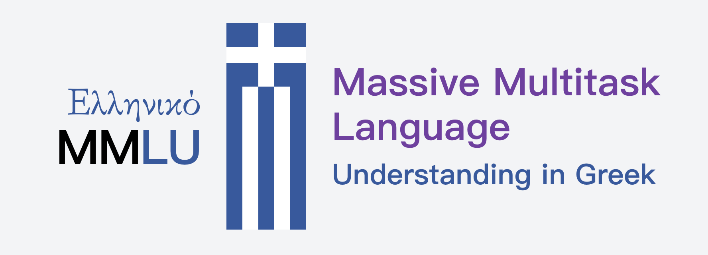

<p align="center">
  
</p>

# GreekMMLU

**GreekMMLU** is a **native-sourced** benchmark for evaluating massive multitask language understanding in **Greek**, built from **authentic Greek exam-style multiple-choice questions** (MCQ) rather than machine-translated English benchmarks.

- **21,805** questions across **45** subjects
- 4 high-level groups: **STEM**, **Humanities**, **Social Sciences**, **Other**
- Difficulty/education levels spanning **Primary → Secondary → University → Professional** (+ an N/A bucket)
- Public vs. private split for contamination-resistant evaluation: **16,857 public**/**4,948 private (leaderboard)**

## Links

- Our paper: https://www.arxiv.org/abs/2602.05150
- Dataset on Hugging Face: https://huggingface.co/datasets/dascim/GreekMMLU
- Private leaderboard: https://huggingface.co/spaces/yangzhang33/GreekMMLU-Leaderboard

## What makes GreekMMLU different?

Most “Greek MMLU” style evaluations rely on **machine translation** from English. Instead, GreekMMLU uses **original Greek content** sourced or authored from real educational/professional assessments, aiming to preserve:

- Greek morphology and punctuation
- Greek-specific cultural/institutional knowledge (e.g., Greek History, Greek Traditions)
- Realistic exam difficulty calibration

## Task format

- Multiple choice, **2–4 options**, **exactly one correct**.
- The harness prompt uses Greek option labels (**Α, Β, Γ, Δ**) for a fully native evaluation setup.

## Using GreekMMLU with LM Evaluation Harness (included)

This repo vendors a copy of **lm-evaluation-harness** under `lm-evaluation-harness/` with GreekMMLU task configs under:

- `lm-evaluation-harness/lm_eval/tasks/greekmmlu/`

The task group name is:

- `greekmmlu` (aggregates across STEM/Humanities/Social Sciences/Other)

### Install

From the repository root:

```bash
cd lm-evaluation-harness
pip install -e .

```


### Quickstart: run evaluation

Run the **aggregate** benchmark:

```bash

# Zero-shot
python -m lm_eval \
  --model hf \
  --model_args pretrained=Qwen/Qwen2.5-0.5B,parallelize=True \
  --tasks greekmmlu \
  --batch_size 1 \
  --num_fewshot 0 \
  --output_path ../results/greekmmlu_0shot \
  --log_samples

# 5-shot
python -m lm_eval \
  --model hf \
  --model_args pretrained=Qwen/Qwen2.5-0.5B,parallelize=True \
  --tasks greekmmlu \
  --batch_size 1 \
  --num_fewshot 5 \
  --output_path ../results/greekmmlu_5shot \
  --log_samples
```

List available tasks:

## Helper script

A simple runner is provided at `run_eval.sh`. It expects an environment variable `WORK_DIR` pointing at the harness directory.

```bash
export WORK_DIR="$PWD/lm-evaluation-harness"
chmod +x run_eval.sh
./run_eval.sh
```

Results are written under `results/`.

## Subjects (high-level)

GreekMMLU includes 45 subjects, grouped into:

- **Humanities** (e.g., Art; Greek History; Greek Literature; Greek Mythology; Law; World Religions)
- **STEM** (e.g., Mathematics; Physics; Computer Science; Electrical Engineering; Medicine)
- **Social Sciences** (e.g., Economics; Education; Government & Politics; Modern Greek Language; Accounting)
- **Other** (e.g., Driving Rules; General Knowledge; Maritime Safety and Rescue Operations)

See the paper for the full taxonomy and educational-level breakdown.

## Citation

If you use GreekMMLU in your work, please cite the paper:

```bibtex
@misc{zhang2026greekmmlunativesourcedmultitaskbenchmark,
      title={GreekMMLU: A Native-Sourced Multitask Benchmark for Evaluating Language Models in Greek}, 
      author={Yang Zhang and Mersin Konomi and Christos Xypolopoulos and Konstantinos Divriotis and Konstantinos Skianis and Giannis Nikolentzos and Giorgos Stamou and Guokan Shang and Michalis Vazirgiannis},
      year={2026},
      eprint={2602.05150},
      archivePrefix={arXiv},
      primaryClass={cs.CL},
      url={https://arxiv.org/abs/2602.05150}, 
}
```

## Notes on data & evaluation

- The dataset is built from **native Greek sources** and curated with quality control, including expert review.
- The benchmark is split into a **public** subset (released) and a **private** subset for leaderboard evaluation.
- Public data is hosted on Hugging Face (`dascim/GreekMMLU`). Please refer to the dataset card for license/terms.
